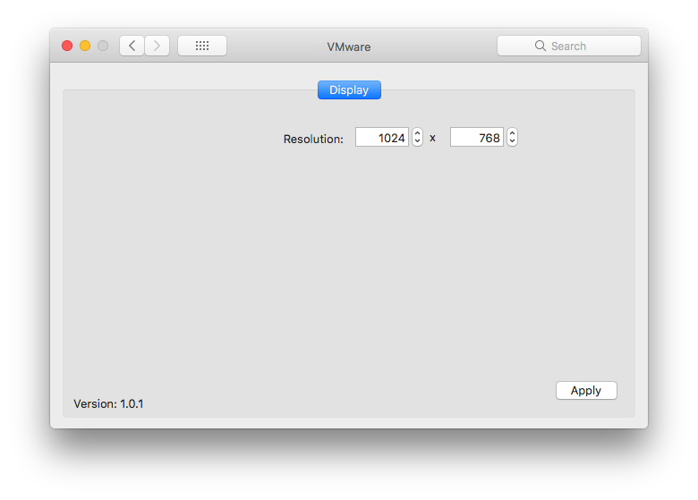
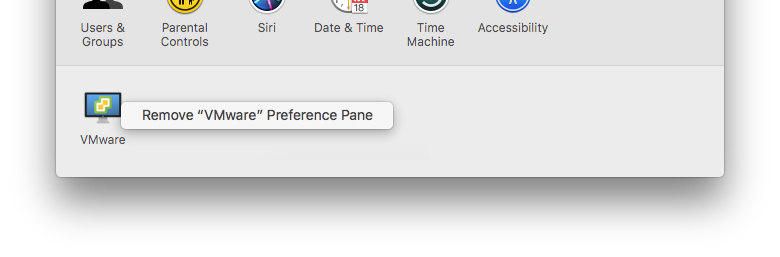

VMware.PreferencePane
=====================

[](https://github.com/MarLoe/VMware.PreferencePane/blob/master/LICENSE)

This is a System Preferences pane to change screen resolution on your macOS guest.



# Introduction
When running macOS as a guest on a WMware host, the way you change screen resolution is using a command line tool that comes with VMware Tools:

```
/Library/Application Support/VMware Tools/vmware-resolutionSet <width> <height>
```

I access my virtual macOS via [VNC Viewer](https://www.realvnc.com/en/connect/download/viewer) from different workstations with different screen sizes. This leaves me with the need to change screen size often - and for some reason I always has to [google](https://www.google.dk/search?q=vmware+osx+change+resolution) how to do this.

# Installing
The installation is currently manual. 

## Manual
Please download and unzip VMware.prefPane.zip from the [latest release](https://github.com/MarLoe/VMware.PreferencePane/releases/latest). 

Then open it by double clicking it or manually copy the VMware.prefPane to one of these locations:

### Current user
```~/Library/PreferencePanes```
```bash
cp -r VMware.prefPane ~/Library/PreferencePanes/
```
### All users
```/Library/PreferencePanes```
```bash
cp -r VMware.prefPane /Library/PreferencePanes/
```

# Building
Use XCode

# Debugging
Since ["System Integration Protection"](https://developer.apple.com/library/content/documentation/Security/Conceptual/System_Integrity_Protection_Guide/Introduction/Introduction.html) was introduced in macOS it is no longer possible to debug system shipped applications.

There are few workarounds for this.

One is of cause to [disable System Integration Protection](https://developer.apple.com/library/content/documentation/Security/Conceptual/System_Integrity_Protection_Guide/ConfiguringSystemIntegrityProtection/ConfiguringSystemIntegrityProtection.html). I find that too invasive.

Another is making a copy of the "System Preferences" application and resign it. See [stack**overflow**](https://stackoverflow.com/a/40708258) for more information on this approach.

I went with the test bed application. So I created "VMware.Debug" that basically loads the VMware.prefPane and displays it. Simply select this target and press "Run".

Selecting the "VMware" target will copy the preferance pane to the users "PreferencePanes" folder and then launch (not debug) the "System Preferences" application. You won't be able to debug, but you can test the preference pane live.
> Sometimes it can be neccessary to remove the existing instalation from the "System Preferences" application first.
>
>


License
-------

VMware.PreferencesPane is released under the [MIT License](https://github.com/MarLoe/VMware.PreferencePane/blob/master/LICENSE).